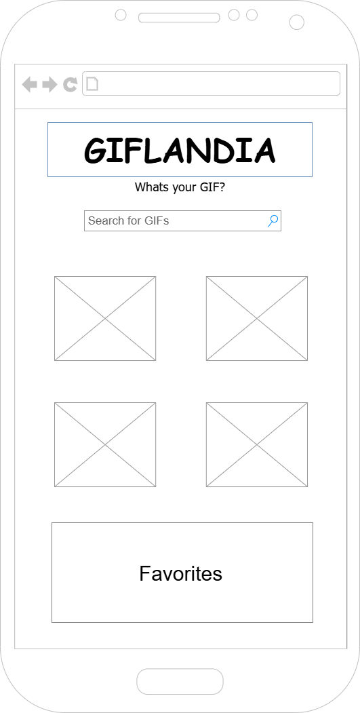
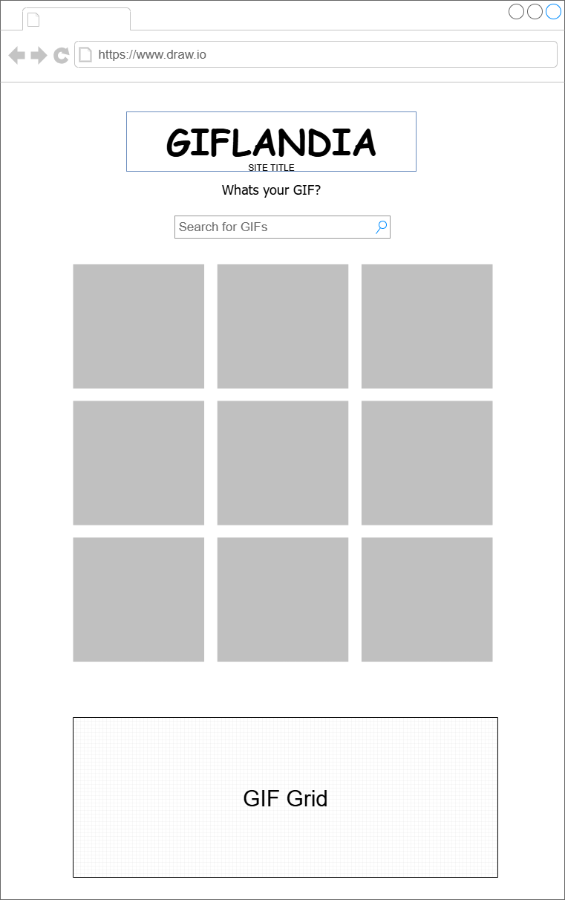

# GIFLANDIA

### Created by: Christine Macias

## Project Overview

**GIFLANDIA** is a dynamic, mobile-friendly GIF search engine powered by the Giphy API.
Users can:
- Search for GIFs using keywords
- Browse GIFs in a responsive, animated layout
- Favorite GIFs during their session

This project demonstrates skills in Javascript, SCSS, responsive design, API integration, and interactive front-end development.

---
## Table of Contents

- [User Stories](#user-stories)
- [Wireframes](#wireframes)
- [Installation Instructions](#installation-instructions)
- [How to Use](#how-to-use-this-website)
- [Technologies USed](#technologies-used)
- [Ideas for future improvement](#ideas-for-future-improvement)

---

## User Stories

- **User Story 1**:
I want to enter a keyword into a search bar and find matching GIFs.  
- **User Story 2**: 
I want results displayed in a neat grid layout for easy browsing.  
- **User Story 3**: 
I want to "favorite" GIFs I like so that I can view them again during my session.  
- **User Story 4**: 
I want the layout to adjust for mobile so I can use it on my phone.

---

## Wireframes

### Mobile Wireframe


### Desktop Wireframe


---

## Installation Instructions

To run this project locally, follow these steps:

1. **Clone the Repository**
Using Git or GitHub Desktop:
```bash 
git clone https://github.com/cmacias076/giflandia.git

2. Navigate to the Project Folder
cd giflandia

3. Open with Live Server or Vite
Option A: Using Live Server (VS Code Extension)
    1. Open the folder in VS Code.
    2. Right-click index.html and choose "Open with Live Server". 
    3. The page should open in your browser and be fully functional.

Option B: Using Vite (if installed)
If you're using Vite:
- npm install
- npm run dev

NOTE: If you're using a .env file for your API key, create it in the root folder:
VITE_GIPHY_API_KEY=your_api_key_here

---

## How to Use This Website

1. Type a keyword (e.g., cats, funny, dancing) into the search bar
2. Click the "Search" button.
3. Browse GIFs in the responsive grid layout.
4. Click the ♡ button to favorite a GIF - it will remain favorited during your current session.

 Visit the site here: [GitHub Pages Link](https://github.com/cmacias076/giflandia) <!-- Will be adding Github Pages Link later on>

---

## Technologies Used

- HTML5  
- SCSS (Sass CSS Preprocessor)  
- JavaScript (ES6+)  
- Giphy API  
- Git & GitHub  
- GitHub Pages (Deployment) 
- Draw.io (Wireframing)  
- Google Fonts

---

## Ideas for Future Improvement

- Add trending GIFs on homepage by default
- Allow download or copy link to share GIFs
- Add animation or theme switcher (light/dark)

---
